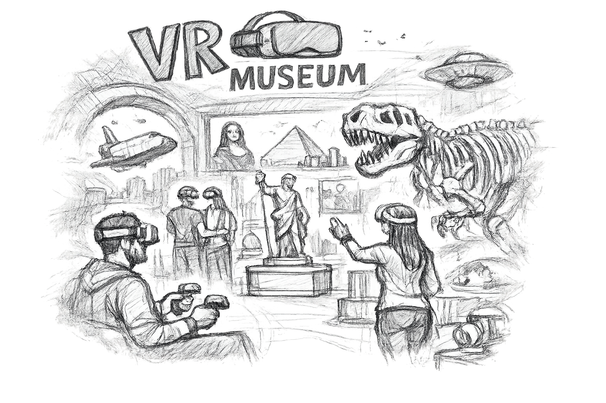

# BCS VR Museum

VR Museum turns search results into an interactive virtual exhibition. Users can search with text, explore related images, videos, and 3D models in VR, and continue searching from any displayed exhibit.



This bachelor thesis prototype is inspired by [VIRTUE](https://github.com/VIRTUE-DBIS). It expands the idea with vitrivr, CLIP-based search, and supports multiple media types. It uses OpenXR to support Meta Quest 3 and VIVE Focus 3.

## Table of contents

- [Motivation](#motivation)
- [Project idea](#project-idea)
- [Scope](#scope)
- [How the system fits together](#how-the-system-fits-together)
- [Supported runtimes](#supported-runtimes)
- [Getting started](#getting-started)
  - [Use an existing build](#use-an-existing-build)
  - [Develop the frontend](#develop-the-frontend)
  - [Reproduce the complete system](#reproduce-the-complete-system)
  - [Understand the source code](#understand-the-source-code)
- [Runtime configuration](#runtime-configuration)
- [Media formats](#media-formats)
- [Repository structure](#repository-structure)
- [Documentation](#documentation)
- [Use of AI during development](#use-of-ai-during-development)

## Motivation

Imagine you want to explore a museum, but it is closed or some parts and exhibits are difficult to access. Digital collections can solve these problems, but traditional websites often present them only as lists of files and thumbnails.

The VR Museum offers an alternative. Instead of displaying search results on a screen, the application transforms them into a three-dimensional exhibition that can be explored with a VR headset.

The project doesn't replicate any specific physical museum. It demonstrates how a digital collection can become a searchable virtual museum.

## Project idea

The museum is built around a simple exploration loop:

1. The user enters the museum.
2. The user explores and interacts with the exhibits.
3. Selecting **Similar** on an exhibit starts a new search from that result.
4. vitrivr finds related images, videos, and 3D models.
5. The application places the results in the virtual museum.
6. The loop starts all over again.

## Scope

The prototype includes:

- text search across a prepared multimodal collection
- similarity search from an existing exhibit
- images, videos, and 3D models in one result space
- video results that preview and start at the matching vitrivr segment
- dynamic placement of media inside the museum
- original-size rooms for 3D models
- controller and hand-tracking input
- standalone and streamed OpenXR builds
- Meta Quest 3 and VIVE Focus 3 support
- a reproducible vitrivr backend and media pipeline

## How the system fits together

The complete system has a few parts:

| Part | What it does |
|---|---|
| VR headset | Displays the museum and receives user input |
| Godot application | Sends searches, loads media, and creates the exhibition |
| vitrivr Engine | Searches the indexed collection |
| Descriptor Server | Creates CLIP descriptors for text and media |
| PostgreSQL with pgvector | Stores the searchable data and vectors |
| Nginx | Sends image, video, and 3D runtime files to the application |
| Media pipeline | Prepares and validates the original files before ingestion |

The detailed C# projects, classes, and Godot scenes are explained in [`src/README.md`](src/README.md).

## Supported runtimes

| Runtime | Target | Controller support | Hand-tracking support |
|---|---|---|---|
| Quest standalone | Meta Quest 3 | ✅ | ✅, including tracked hand meshes |
| Focus standalone | VIVE Focus 3 | ✅ | ✅ |
| Windows streaming | Meta Quest 3 or VIVE Focus 3 | ✅ | ❌ |

Running the museum directly inside the Godot editor is not supported.

## Getting started

Choose the guide that matches what you want to do.

### Use an existing build

Follow [`run/README.md`](run/README.md) to:

- install a Quest or Focus APK with ADB
- copy optional local media
- run the Windows streaming build
- inspect application logs

Packaged builds can be obtained from the [GitHub Releases page](https://github.com/jannick1312/BCs-VR-Museum/releases).

### Develop the frontend

Follow [`tools/godot/README.md`](tools/godot/README.md) to install Godot and .NET. Then open `src/GodotMuseum/project.godot` in Godot.

### Reproduce the complete system

Start with [`tools/README.md`](tools/README.md). It contains the complete setup order and links to every section of the Ubuntu, vitrivr, pipeline, Nginx, Godot, and runtime guides.

Complete the verification section of each guide before continuing to the next stage.

### Understand the source code

Read [`src/README.md`](src/README.md) for:

- the .NET project dependencies
- the purpose of each source project
- the Godot scene structure
- the startup and search flow
- media loading and placement

## Runtime configuration

The shared deployment configuration in `run/config.json` contains `serverIp`, `tutorial`, and the initial `query`. Android receives a copy of this file during sideloading, while Windows streaming reads it from the shared `run` directory during startup.

See the [configuration section](run/README.md#configuration) for the exact paths and deployment behavior.

## Media formats

See [`tools/pipeline/README.md`](tools/pipeline/README.md) for accepted input formats, conversion, backups, validation, and PCK generation.

## Repository structure

```text
BCs/
├── README.md                    # Project overview
├── src/
│   ├── README.md                # Source code explanation
│   ├── Application/             # Search and validation use cases
│   ├── Application.Abstractions/# Frontend application contract
│   ├── Application.Factory/     # Connection of application and infrastructure
│   ├── Core/                    # Models for queries and search results
│   ├── Infrastructure.Media/    # Local and HTTP media loading
│   ├── Infrastructure.Vitrivr/  # vitrivr communication
│   ├── Logger/                  # Logger for front and backend
│   ├── Models/                  # Models and enums for front and backend
│   └── GodotMuseum/             # Godot project and XR application
├── run/
│   ├── README.md                # Running and installing builds
│   ├── config.json              # Default config file
│   ├── deployment/              # Android scripts
│   ├── media/                   # Optional local media
│   └── stream/                  # Windows build
├── tools/
│   ├── README.md                # Complete reproduction guide
│   ├── ubuntu/                  # Ubuntu setup
│   ├── vitrivr/                 # vitrivr setup and configuration
│   ├── pipeline/                # Media preparation
│   ├── nginX/                   # Nginx setup
│   └── godot/                   # Godot development setup
└── docs/                        # Thesis and presentation files
```

## Documentation

| Document | Purpose |
|---|---|
| [`src/README.md`](src/README.md) | Source projects, classes, scenes, and runtime flows |
| [`run/README.md`](run/README.md) | Configuration, installation, streaming, media, and logs |
| [`tools/README.md`](tools/README.md) | Complete reproduction order and guide index |
| [`tools/godot/README.md`](tools/godot/README.md) | Godot development, export, and headset testing |
| [`tools/ubuntu/README.md`](tools/ubuntu/README.md) | Ubuntu server packages |
| [`tools/vitrivr/README.md`](tools/vitrivr/README.md) | vitrivr backend, database, startup, and ingestion |
| [`tools/pipeline/README.md`](tools/pipeline/README.md) | Media conversion, validation, and PCK generation |
| [`tools/nginX/README.md`](tools/nginX/README.md) | Nginx media delivery |

## Use of AI during development

During the development of this project, Codex was used with models 5.5 and 5.6. It was used especially while preparing the server backend because setting up the backend was not a main part of the bachelor thesis. All Python scripts located in [`tools/pipeline`](tools/pipeline/) were generated entirely with the help of these models. This generated code was not manually reviewed by the creator of this repository. For the same reason, the explanatory section [Processing details](tools/pipeline/README.md#processing-details) was also written with the assistance of Codex.

Since the pipeline consists of several scripts, Codex was prompted repeatedly until the intended and documented behavior was achieved. The generated code was evaluated by executing the scripts and checking the results.

The [scripts](tools/vitrivr/scripts/) used to simplify starting and resetting the vitrivr server were also created with the assistance of Codex. Codex was given the individual steps required to start and reset the service. It then combined these steps into two scripts that execute the complete process within a tmux session.

Since the creator of this repository primarily uses a MacBook, the `.bat` scripts located under [`run/deployment`](run/deployment/) were generated by Codex based on the corresponding Bash scripts.

All code located in [`src`](src/) was written by the creator of this repository. The code documentation, however, was generated with the assistance of Codex and subsequently reviewed by the creator. Files where Codex also assisted with the implementation are marked at the bottom of the file.

All hand-drawn technical pencil illustrations used in the project, including [vr-sketch.png](src/GodotMuseum/Menu/Settings/vr-sketch.png), [icon.png](src/GodotMuseum/Assets/Icon/icon.png) and the hand/controller sketches used in the [tutorial slides](src/GodotMuseum/Tutorial/Slides/), were generated with ChatGPT 5.6 over multiple sessions and refined through several revisions. The general workflow involved providing a reference image, for example a particular hand pose and instructing the model to transform it into the desired pencil-sketch style.
